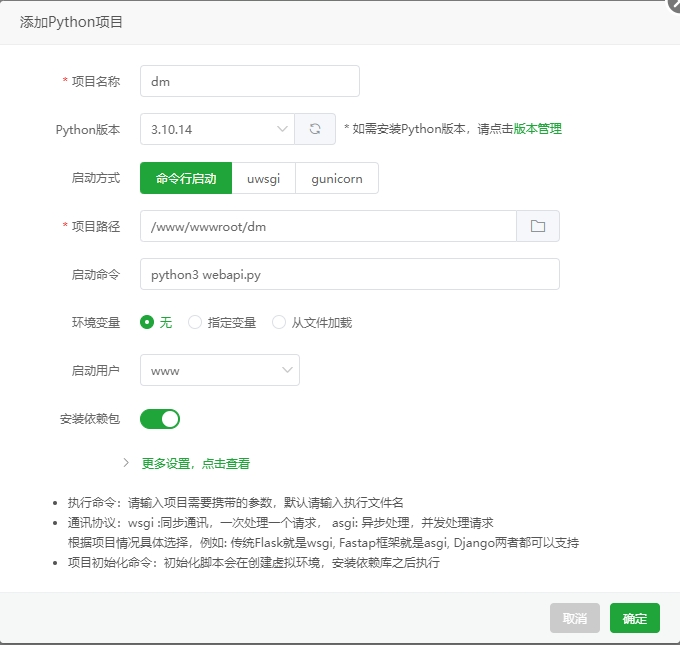
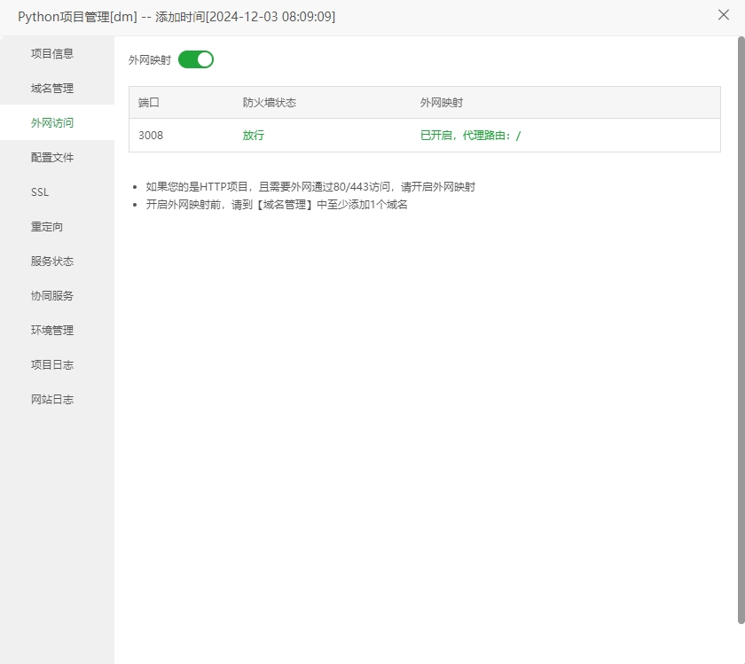

# 证件照动漫风图片API端

# 介绍
一款Python版本的图片转新海诚动漫风格服务
<br>
二次开发源码来自：https://swanhub.co/ZeYiLin/White-Box-Cartoon

<br>

<hr>

# 环境
Python 版本：3.10.14

<br>
<hr>

# 运行
1.宝塔创建项目



2.需要绑定域名并开启外网映射


<br>
<hr>

# HTTP请求
```text
POST
http://你的域名/cartoon

传参：
参数名：image
内容是：base64的图片

注：无法通过ip直接请求，所以需要绑定域名     
```
